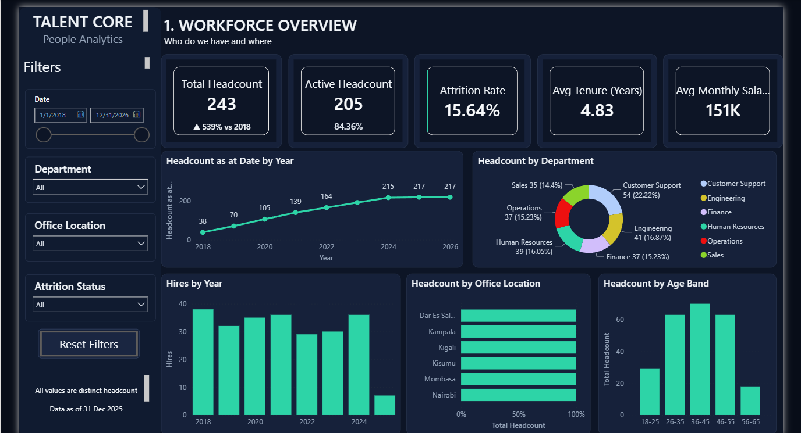
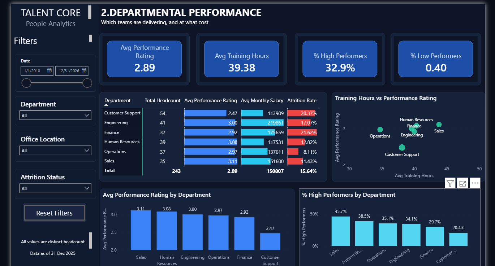
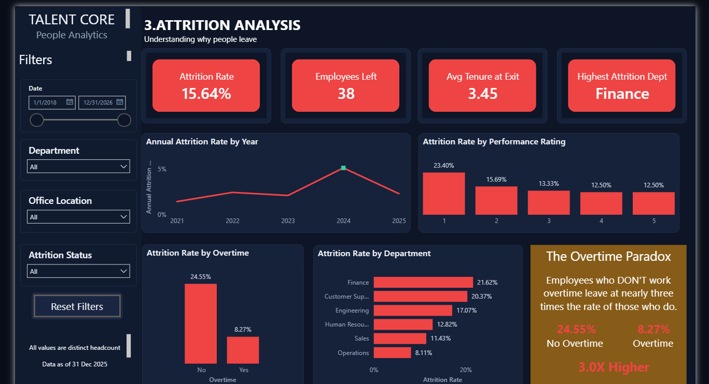
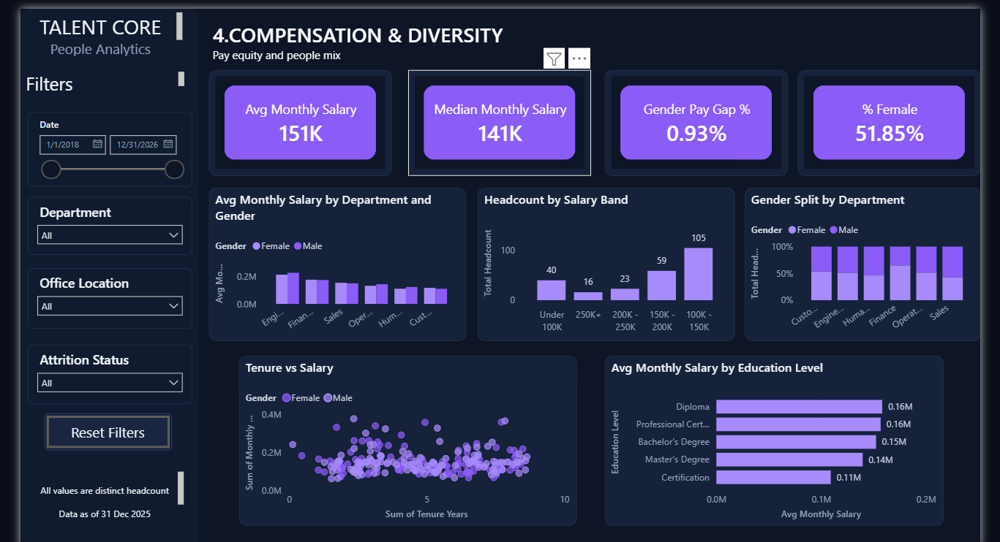
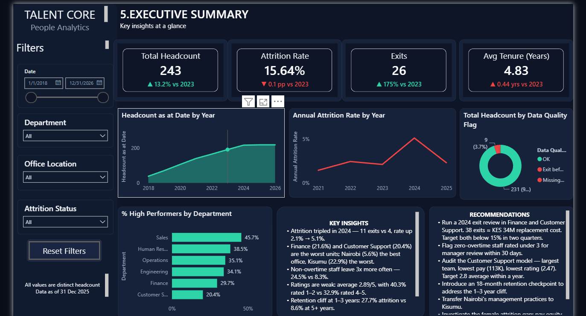
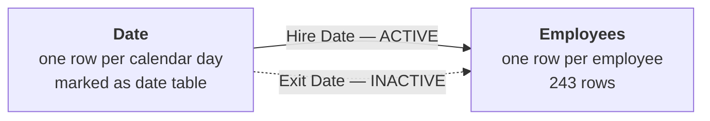

# TalentCore Workforce Analytics — Attrition, Compensation & Performance

**A full CRISP-DM people analytics project: 1,000 rows of deliberately broken HR data turned into a five-page Power BI decision tool, 39 DAX measures, and a 21-page methodology report.**

> 📄 **[Read the full CRISP-DM report (PDF)](Talent_Core_Report.pdf)** · 📂 **[Download the .pbix](Talent_Core_Project.pbix)** · 📊 **[Raw dataset](TalentCore_HR_Workforce_Data.xlsx)**

---

### The brief

TalentCore is a pan-African technology services company with 243 employees across six departments and six East African offices. Leadership had committed to data-driven people decisions but had no single view of workforce health — attrition, pay and performance all sat in one operational extract that had never been analysed.

Six questions were on the table:

1. How many people do we employ, and how has that changed?
2. What is our attrition rate, and is it rising?
3. Which departments, offices and segments carry the most risk?
4. Is pay equitable across gender, department and education?
5. How does performance vary, and does training explain it?
6. What should leadership actually do in the next twelve months?

Every one of them is answerable from the dashboard without further analysis. That was the success criterion.

---

### Headline results

| Metric | Value | Metric | Value |
| --- | --- | --- | --- |
| Total headcount | 243 | Average monthly salary | KES 150,807 |
| Active employees | 205 (84.4%) | Median monthly salary | KES 141,000 |
| Employees who left | 38 | Gender pay gap | 0.9% |
| Overall attrition rate | 15.6% | Average performance rating | 2.89 / 5 |
| Average tenure | 4.8 years | Employees rated 1–2 | 40.3% |
| Average tenure at exit | 3.5 years | Estimated cost of attrition | KES 34.4M |

---

### Dashboard preview

**1 — Workforce Overview** *(who do we have, and where?)*

**2 — Departmental Performance** *(which teams are delivering, and at what cost?)*

**3 — Attrition Analysis** *(why do people leave?)*

**4 — Compensation & Diversity** *(is pay equitable?)*

**5 — Executive Summary** *(what should leadership do?)*

A sixth page — **Employee Detail** — is hidden and reached by right-clicking any department to drill through to the individual employees behind the number, with headcount, attrition and average salary recalculated for that department alone.

---

### Why this project is different: the data was broken on purpose

The source file had 1,000 rows. **753 of them contained a hire date and nothing else.** Loading it as-is would have inflated headcount fourfold and computed every average over a majority of nulls. That was the first thing profiling caught, and it set the tone for the rest of the cleaning work.

| Field | What was wrong | Actual values found |
| --- | --- | --- |
| Employee ID | Whitespace, case drift, stray decimal suffix, 4 duplicates | `" EMP-1100 "`, `emp-1164`, `EMP-1285.0` |
| Exit Date | Six date formats, five text placeholders, Excel serials stored as text | `2024.11.02`, `13-Dec-2024`, `05/27/2025`, `44804`, `"Still Active"`, `"-"` |
| Education Level | Fifteen spellings of four qualifications | `Bachelors`, `BSc`, `"bachelor's degree"`, `MSc`, `Masters`, `DIPLOMA` |
| Overtime | Six encodings of a boolean | `Yes`, `yes`, `Y`, `TRUE`, `1` / `No`, `N`, `FALSE`, `0` |
| Office Location | Case variants and misspellings | `DSM`, `Niarobi`, `Mombassa` |
| Age | Text suffixes and impossible values | `"57 yrs"`, `−5`, `200` |
| Monthly Salary | Currency prefixes, separators, one negative | `"KES 242,800"`, `"97,700"`, `−105,900` |
| Performance Rating | Three encodings | `4`, `4/5`, `"4 out of 5"` |

Beyond formatting, the data contradicted itself: nine employees had an **exit date earlier than their hire date** (one from before the company's first recorded hire), three leavers had no exit date at all, and four IDs appeared twice.

**Every fix was made in Power Query, not by hand.** Thirteen documented steps, re-runnable against any future extract, with no manual editing of the source file. The pipeline took 1,000 rows to 243 analysable employees at **95.1% completeness**, and added a Data Quality Flag column so the twelve remaining problem records stay visible rather than silently disappearing.

Judgement calls were documented rather than hidden — each recorded with its reasoning and the alternative that was rejected, so a reviewer can disagree with a decision instead of being misled by it. Full transformation log in **[Section 3 of the report](Talent_Core_Report.pdf)**.

---

### The data model

A two-table star: one `Employees` fact table joined to a `Date` dimension. At 243 rows with low-cardinality attributes, splitting Department, Office, Gender and Education into separate dimension tables would have added joins without improving performance or clarity — a flat star is the right call at this scale, and knowing *when not to normalise* is part of the skill.

The decision that shapes the whole analysis is **Date as a role-playing dimension**:

| From | To | Cardinality | State |
| --- | --- | --- | --- |
| `Date[Date]` | `Employees[Hire Date]` | One to many | **Active** |
| `Date[Date]` | `Employees[Exit Date]` | One to many | Inactive |

Power BI permits only one active relationship between two tables. Hire Date holds it; Exit Date is joined inactively and activated inside individual measures with `USERELATIONSHIP`. Without that second relationship a date slicer has no path to reach Exit Date at all — **no attrition trend could be produced.**

---

### Measures that needed care

39 measures were built. Two are worth calling out because both are silent-failure traps:

**`Exits` must explicitly exclude blank exit dates.** Activating a relationship does not itself filter anything — without the exclusion, an unfiltered card returns all 243 rows instead of 26 exits.

**`% Low Performers` must exclude blanks.** In DAX a blank evaluates as less than or equal to 2, which would have quietly classified five unrated employees as low performers.

| Measure | Definition | Result |
| --- | --- | --- |
| `Total Headcount` | `DISTINCTCOUNT` of Employee ID | 243 |
| `Attrition Rate` | Employees Left ÷ Total Headcount | 15.6% |
| `Exits` | Row count via the inactive Exit Date relationship, excluding blanks | 26 |
| `Headcount as at Date` | Hired on or before the date, and still employed or exited after it | 217 at end-2025 |
| `Annual Attrition Rate` | Exits ÷ Headcount as at Date | 5.1% in 2024 |
| `Gender Pay Gap %` | (Male avg − Female avg) ÷ Male avg | 0.9% |
| `% Low Performers` | Share rated 1–2, excluding blanks | 40.3% |
| `Data Completeness %` | Records without a quality flag ÷ total | 95.1% |

Every measure was validated against an independent recalculation of the source before going on a page. **Three errors were caught that way** — an attrition trend routing through the wrong relationship, a low-performer measure counting blanks, and an exits figure still including nine impossible dates.

---

### Key insights

**1 — Attrition more than doubled in 2024.**
Annual attrition rose from 2.1% to **5.1%** in a single year, with exits jumping from four to eleven while hiring stayed flat. After three years of exceptional retention, 2024 is a break in trend, not a continuation of one.

**2 — The overtime paradox.**
Conventional wisdom says overworked people burn out and leave. TalentCore's data says the opposite: employees who work **no overtime leave at 24.5%, three times the 8.3% rate** among those who do. Both groups are large (110 and 133), so this isn't small-sample noise. The most plausible reading is that overtime here proxies for *engagement*, not workload — making low overtime an early-warning signal rather than a sign of healthy balance.

**3 — A retention cliff at one to three years.**
Attrition runs at **27.7%** in the 1–3 year band, falling to 13.3% at 3–5 years and 8.6% beyond five. The company loses people at precisely the point where recruitment and onboarding investment has been made but not yet recovered.

**4 — Nairobi retains four times better than Kisumu, and pay doesn't explain it.**
Nairobi loses 5.6% of staff; Kisumu loses **22.9%** — near-identical office sizes, average salaries within KES 7,000 of each other. This is the largest unexplained variance in the dataset and the cheapest opportunity available, because the practice that works already exists inside the company.

**5 — Performance is the deeper problem.**
More employees are rated 1–2 (40.3%) than 4–5 (32.9%), against a company average of 2.89/5. Customer Support — the **largest** department at 54 people and the **lowest paid** at KES 114K — averages 2.47. Training doesn't explain it: hours range narrowly from 35 to 44 across departments and show no relationship with rating.

**6 — Pay is equitable; retention is not.**
The gender pay gap is a negligible **0.9%**. But women leave at 19.8% against 11.1% for men — a gap of 8.7 points that the compensation data cannot explain.

---

### Recommendations

Seven recommendations, each with an owner, a timeline, a target and the dashboard metric that tracks it:

| # | Recommendation | Owner | Target |
| --- | --- | --- | --- |
| R1 | Commission a structured exit review for 2024 departures | CHRO / People Ops | Finance & Customer Support below 15% in two quarters |
| R2 | Treat low overtime as an early-warning signal, not a wellbeing win | Department heads | Flagged cohort retained at or above baseline |
| R3 | Audit the Customer Support operating model — not its training volume | COO / CHRO | Rating 2.8, attrition below 15% in 12 months |
| R4 | Introduce an 18-month retention checkpoint before the risk window opens | People Ops | 1–3 year band below 18% |
| R5 | Document Nairobi's retention practices and pilot them in Kisumu | Regional HR | Kisumu below 15% |
| R6 | Investigate the female attrition gap — pay has been ruled out | CHRO / D&I | Gap below 4 points |
| R7 | Fix data capture at source | People Ops / IT | Completeness above 99% at next refresh |

R2 carries an explicit guardrail: the objective is detecting disengagement early, **not** rewarding presenteeism.

---

### What this analysis cannot tell you

Stating limits is part of the deliverable, not an apology for it.

| Limitation | Consequence |
| --- | --- |
| Only 243 usable records | Job-role figures rest on 6–14 employees each — signals, not conclusions |
| 12 of 38 leavers lack a usable exit date | Trend charts plot 26 exits, so **every trend figure understates true attrition** |
| No exits recorded before 2021 | Three years of perfect retention is more likely a data artefact than a result |
| Snapshot, not longitudinal | Year-on-year comparison of pay or performance is impossible |
| 2025 is a partial year | The final data point on every trend understates the full year |
| No manager, engagement or exit-reason data | The analysis shows *where* attrition happens, never directly *why* |

Findings are graded by confidence in the report — the 2024 spike and the overtime relationship are High; the departmental ranking is Medium; job-role hotspots are Low. **Recommendations propose investigation wherever causation could not be established.**

---

### What's in this repo

| File | Description |
| --- | --- |
| [`Talent_Core_Report.pdf`](Talent_Core_Report.pdf) | 21-page CRISP-DM methodology report — transformation log, assumptions, validation, insights, recommendations, appendices |
| [`Talent_Core_Project.pbix`](Talent_Core_Project.pbix) | Power BI file — 6 pages, 39 measures, cleaned model and full Power Query pipeline |
| [`TalentCore_HR_Workforce_Data.xlsx`](TalentCore_HR_Workforce_Data.xlsx) | The raw, uncleaned source extract — 1,000 rows, 16 columns, exactly as received |

The raw file is included deliberately. Open it alongside the .pbix and the entire cleaning pipeline is reproducible and auditable end to end.

---

### Skills demonstrated

| Skill | Where it shows |
| --- | --- |
| **CRISP-DM methodology** | All six phases documented — business understanding through deployment |
| **Power Query (M)** | 13-step repeatable pipeline; six date formats parsed, 15 category variants mapped, no manual edits |
| **Data quality engineering** | Profiling, contradiction testing, quality flagging, a completeness measure surfaced on the executive page |
| **Advanced DAX** | 39 measures; `USERELATIONSHIP` on a role-playing date dimension; blank-handling traps identified and fixed |
| **Dimensional modelling** | Two-table star with inactive relationship; deliberate decision *not* to over-normalise |
| **Report architecture** | 5 pages plus hidden drill-through, synchronised slicer rail, reset control, colour-coded lenses |
| **Analytical judgement** | Confidence grading, documented assumptions, limitations stated up front |
| **Business communication** | Recommendations with named owners, timelines, targets and tracking metrics |

---

### Tools

**Power BI Desktop** · **DAX** · **Power Query (M)** · **Microsoft Excel** · CRISP-DM

---

### About the dataset

TalentCore is a **case-study dataset** built for HR analytics practice, with data quality issues introduced deliberately. It was chosen precisely for that reason: clean data demonstrates chart-building, while broken data demonstrates the profiling, judgement and documentation that make an analysis trustworthy.

---

**Wanjiku Waweru** · BBS Financial Engineering, Strathmore University
[GitHub](https://github.com/ShikohWaweru)

